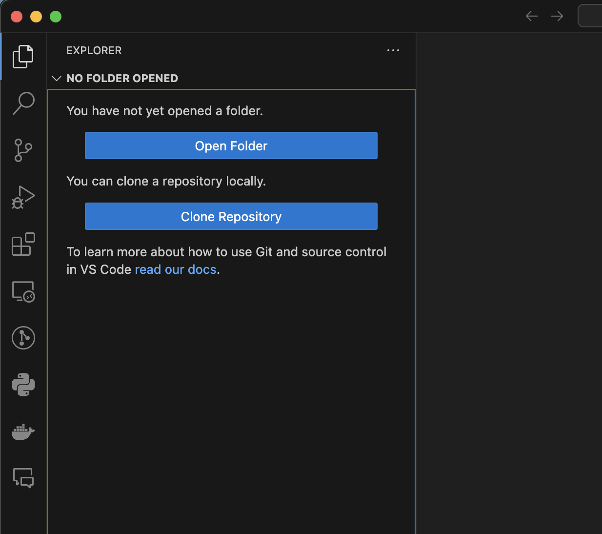
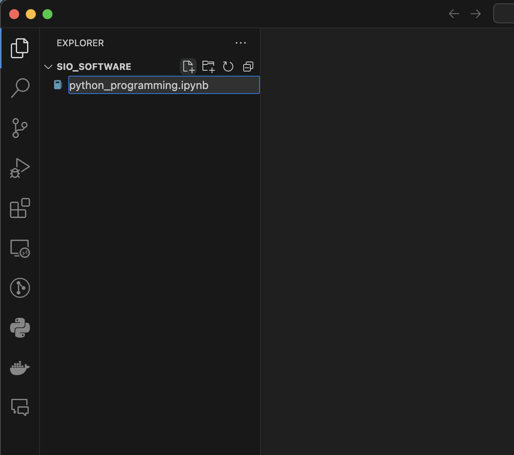
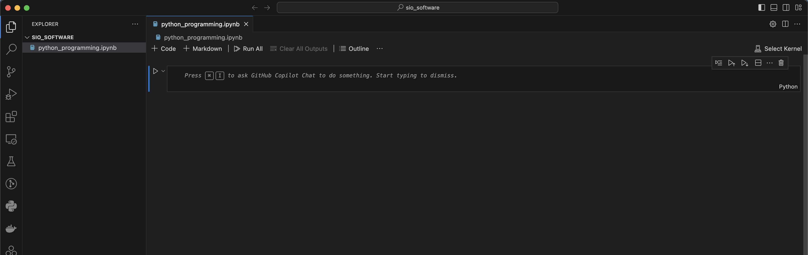
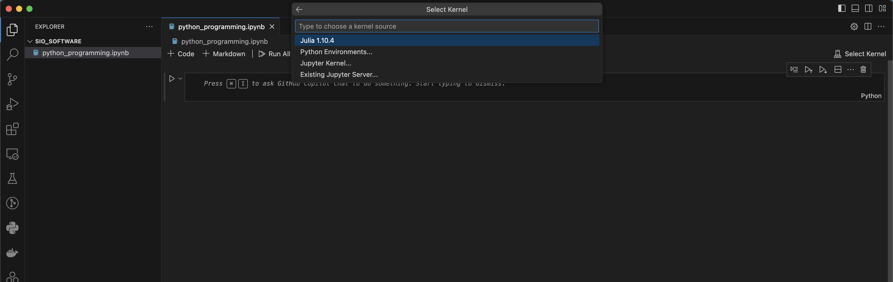
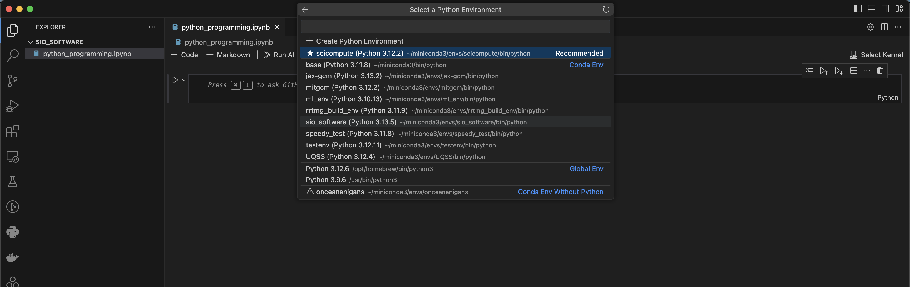
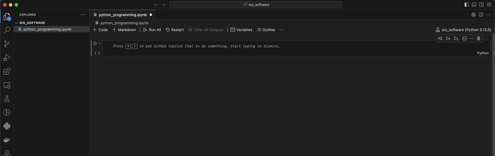

# Jupyter Notebook and Conda in VSCode

This tutorial assumes that you have installed conda and created a conda environment for the workshop. It also assumes that you have downloaded and installed the VSCode application and added extensions for: Python and Jupyter.

1) Open the VSCode application and use the file navigator to open a folder to save your work during the workshop. 

2) Create a new file, and make sure it has the .ipynb ending which will indicate to VSCode that it is a Jupyter notebook.

3) Once you save the new name, the file should show a Jupyter cell and a spot in the upper right to `Select Kernel`.

4) Click `Select Kernel` and from the drop down menu select `Python Environments`.

5) This will show you a list of available conda environments, select the one you made for this workshop.

6) At the end you should have a Jupyter cell with the selected conda environment indicated in the upper right.

